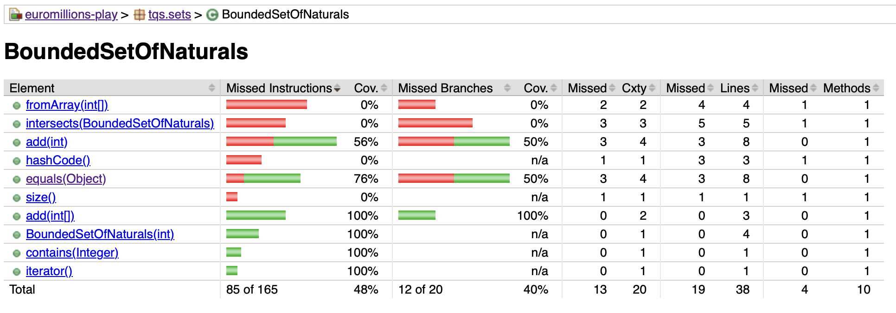
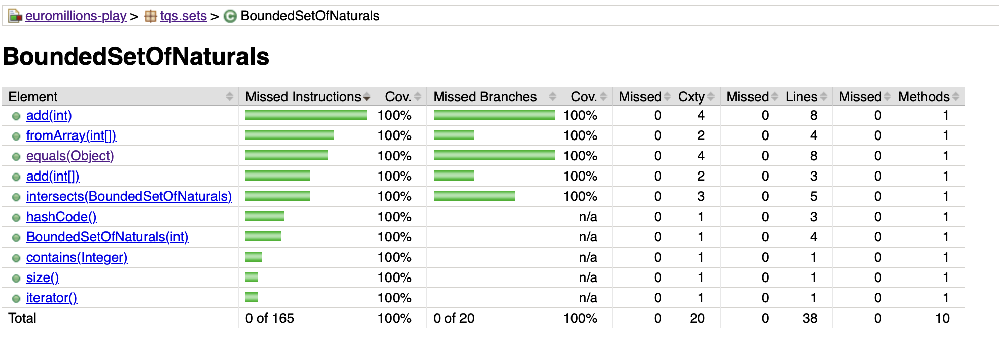

# Notas/Resposta às Perguntas #

**Exercício  2.C)**

Os teste que valem a pena serem escritos e que o devem ser são: 
* Testar as três exeções do método ***add(int)***
* Testar o método ***fromArray(int)***
* Testar o método ***intersect(BoundedSetOfNaturals)***
* Testar os métodos ***hashCode()*** e ***equals(Object)***

**Exercício  2.D)**

Como se pode ver pelas análises do antes e depois da classe ***BoundedSetOfNaturals***, os testes analisaram toda a classe.

**Antes:**

**Depois:**
