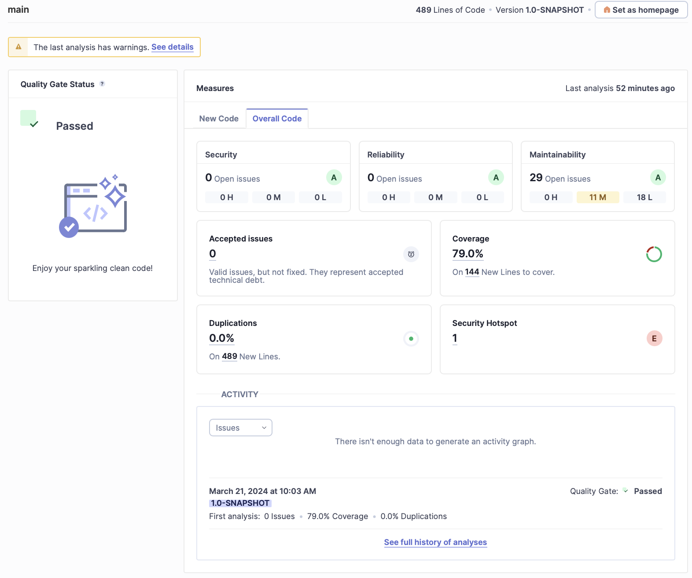
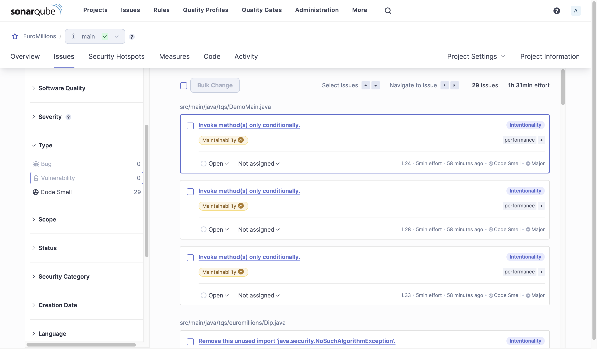

# Notas/Resposta às Perguntas #

## Correr o server do SonarQube

Para correr o server do SonarQube usei o comando:

```bash
$ docker run -d --name sonarqube -e SONAR_ES_BOOTSTRAP_CHECKS_DISABLE=true -p 9000:9000 sonarqube:latest
```


## Teste do Euromilions

Depois de correr o comando:

```bash
mvn clean verify sonar:sonar \
  -Dsonar.projectKey=EuroMillions \
  -Dsonar.projectName='EuroMillions' \
  -Dsonar.host.url=http://localhost:9000 \
  -Dsonar.token=sqp_acf9d72ce5d7f3c362d04fb3e2ccb4e6bd665579
```

O meu projeto passou a *Quality Gate* definida, com uma cobertura de __79%__, __0__ *bugs*, __0__ *vulenabilidades*, __29__ *Code Smell* e __1__ *Security Hotspot*, tal como se pode ver pelo screenshot abaixo.




| Issue | Problem Description | How to solve |
|-|-|-|
| Bug | Não há registos de Bugs | - |
| Vulnerability | Não há registos de Vulnerabilidades | - |
| Code smell (major) | Invoke method(s) only conditionally - Ficheiro __*DemoMain.java*__ linha 24, 28 e 33 | Chamar este métodos só sob condições específicas, que justifiquem sua execução. |
| Code smell (major) | This block of commented-out lines of code should be removed - Ficheiro __*Dip.java*__ linha 35 e 39 | Remover o código que esta comentado. |
| Code smell (major) | Refactor the code in order to not assign to this loop counter from within the loop body - Ficheiro __*Dip.java*__ linha 82, 83, 89 e 90 | Reestruturar o loop ou usar uma variável diferente para os cálculos dentro do loop. |