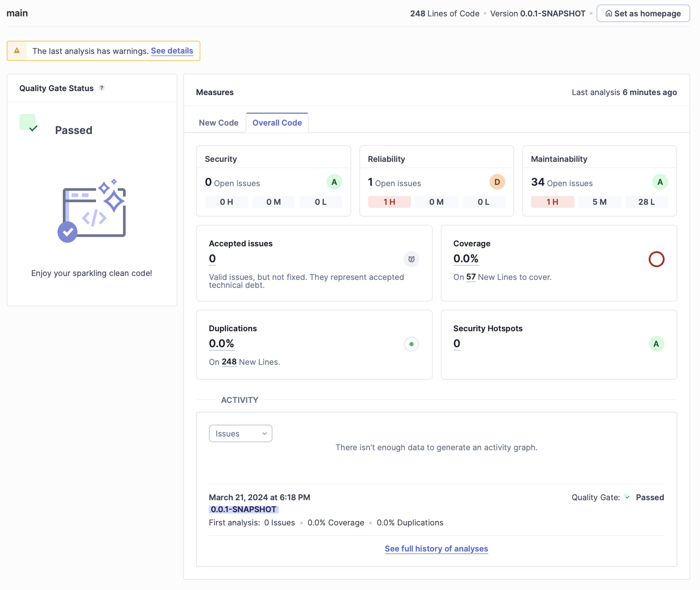
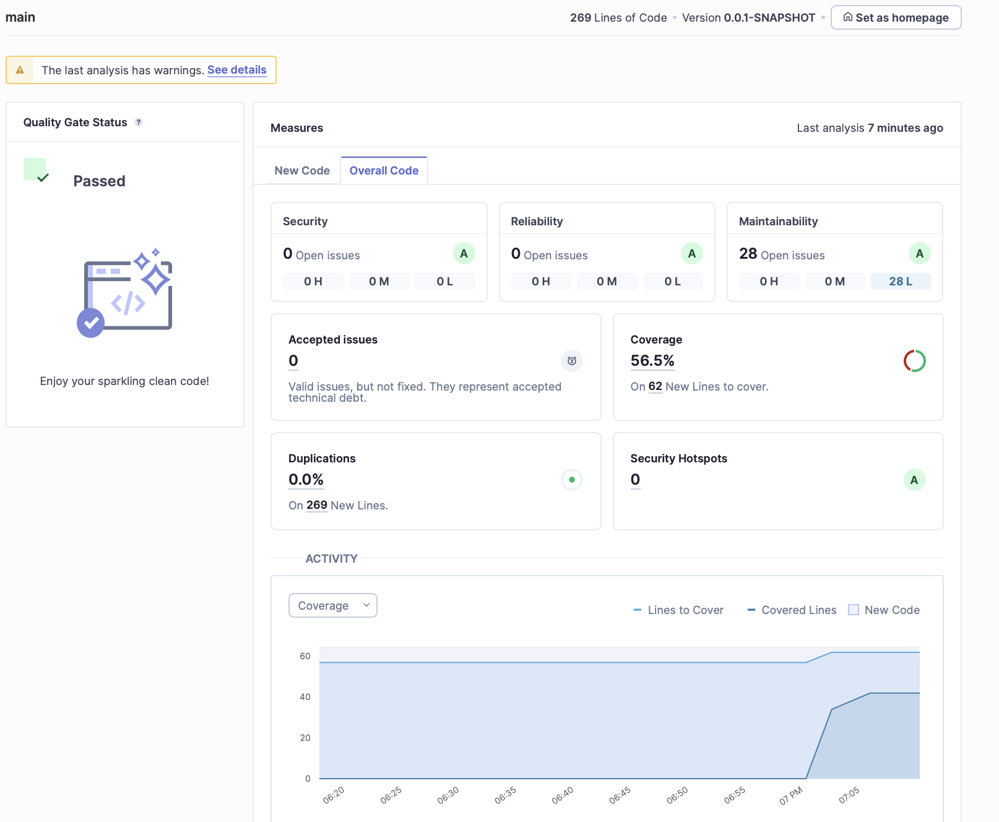
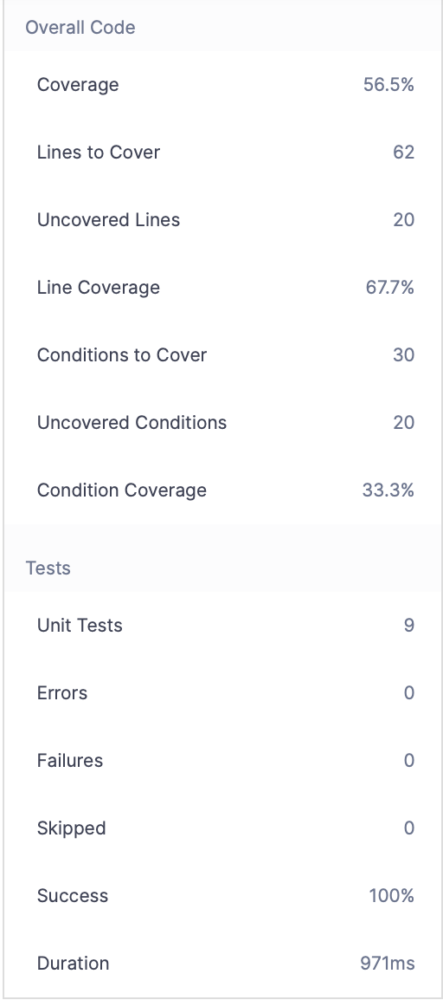

# Notas/Resposta às Perguntas #

## Correr o server do SonarQube

Para correr o server do SonarQube usei o comando:

```bash
$ docker run -d --name sonarqube -e SONAR_ES_BOOTSTRAP_CHECKS_DISABLE=true -p 9000:9000 sonarqube:latest
```

## Teste do CarsService

Depois de correr o comando:

```bash
mvn clean verify sonar:sonar \
  -Dsonar.projectKey=CarsService \
  -Dsonar.projectName='CarsService' \
  -Dsonar.host.url=http://localhost:9000 \
  -Dsonar.token=sqp_5560fbd09ce734fcd341729e93866fd71281346e
```

O meu projeto passou a *Quality Gate* definida, com uma cobertura de __0%__, __1__ *bug*, __0__ *vulenabilidades*, __34__ *Code Smell* e __0__ *Security Hotspot*, tal como se pode ver pelo screenshot abaixo.

O __*Technical Debt found*__ é de __2h__, o que significa que seriam necessárias aproximadamente duas horas para resolver os *Code Smell*/Problemas econtrados no código.

## __Análise antes de resolver qualquer problema:__



## __Análise depois de resolver os critical e major *Code Smell* e adicionar o *Jacoco*:__



Depois da análise:
  * 56,5% de cobertura;
  * 62 linhas de código por cobrir;
  * 30 condições por cobrir.

