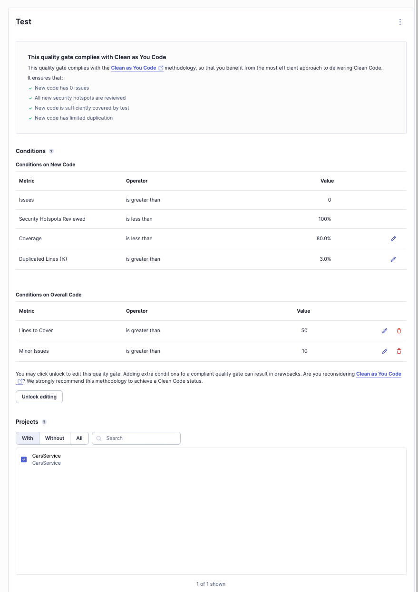
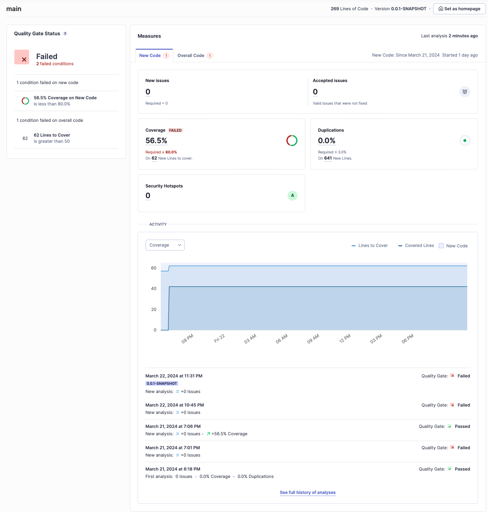

# Notas do Lab6_3 - Custom Quality Gate #

Para este exercício continuei a usar o exercício do __CarsService__ que foi melhorado no execercício anterior (*Lab6_2*).

Criei uma nova __*Quality Gate*__ com base na __*Quality Gate*__ default, com a adições de estas novas condições:
* *Lines to cover* seram maiores que 50;
* *Minor Issues* seram maiores que 10.

  

Isto foi feito para que, mais facilmente, as condições do __*Quality Gate*__ sejam violadas. O códido não passou a __*Custom Quality Gate*__, tal como se pode ver!

